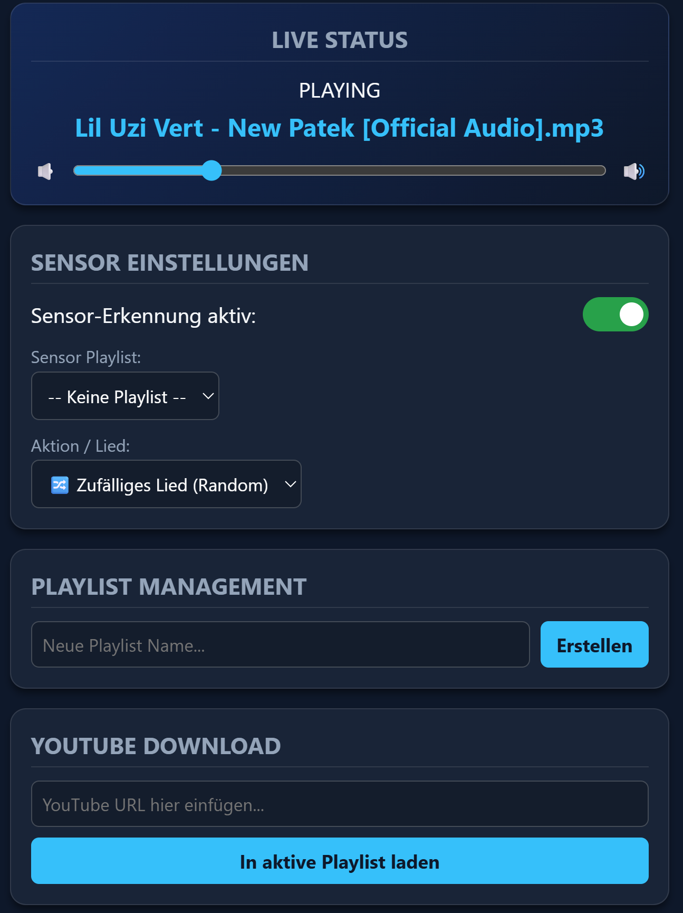
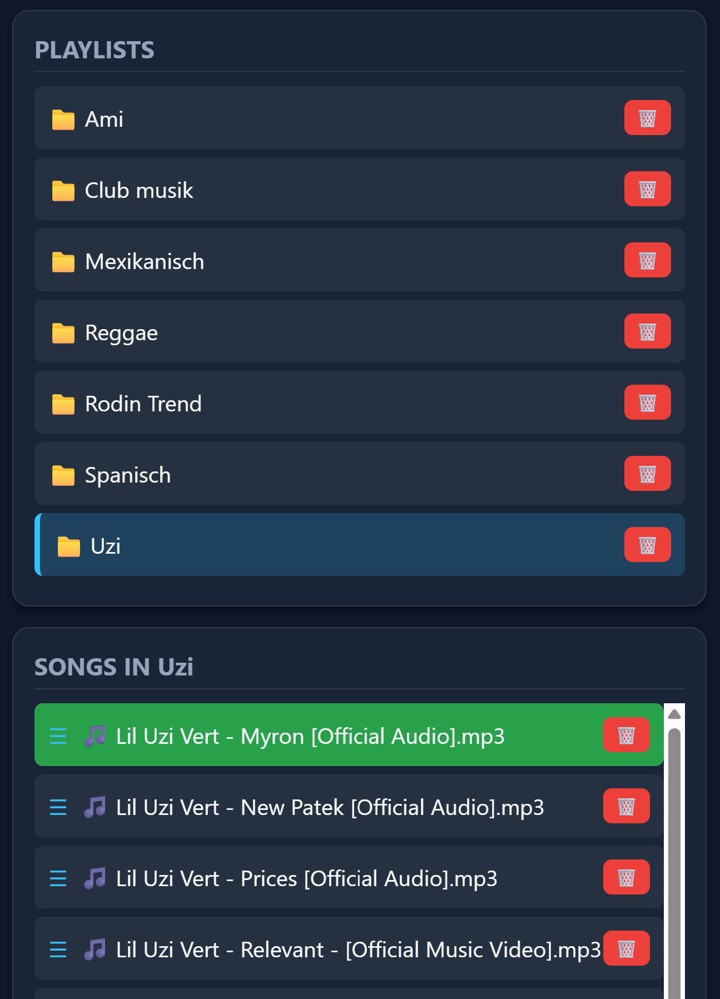
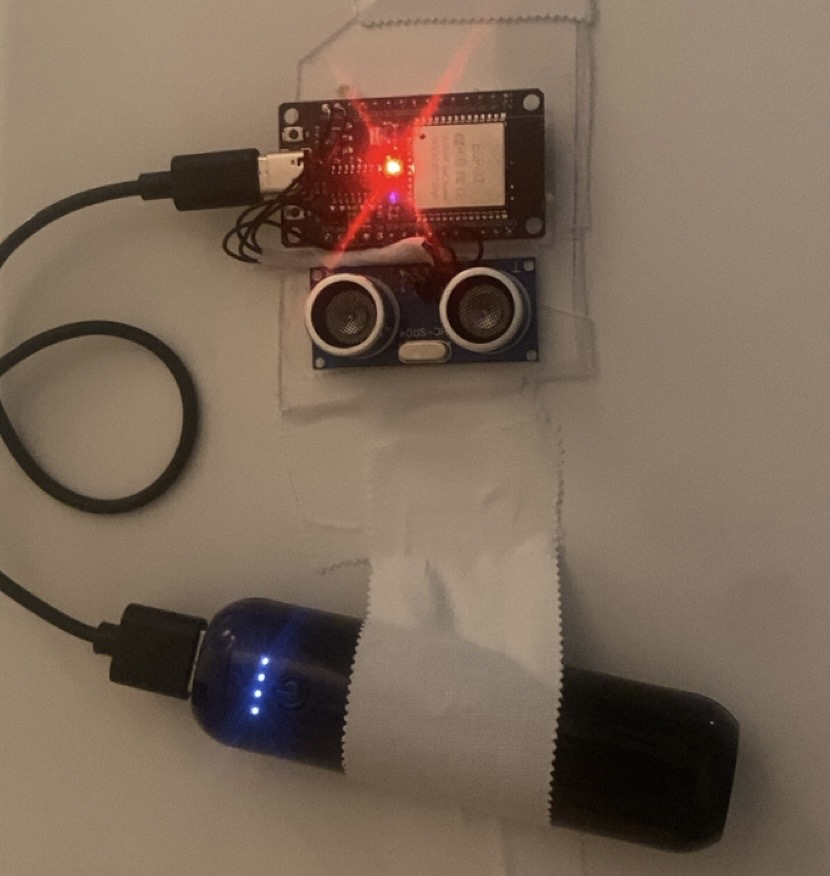
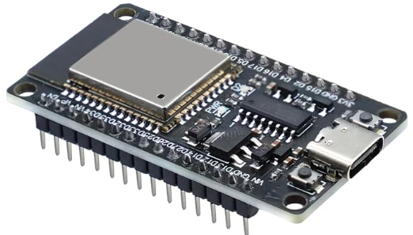
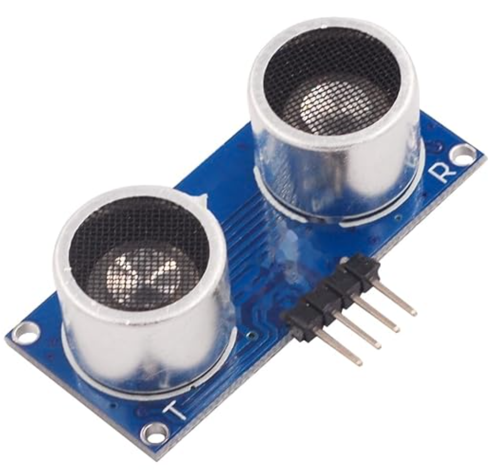
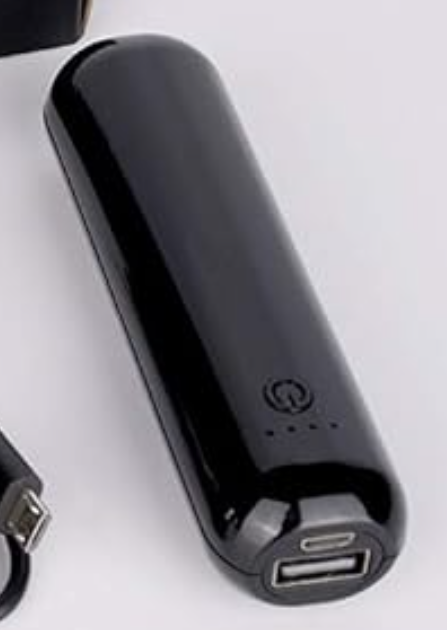

# Music-pannel
An automated smart-home music system that detects when someone enters the room via a door sensor and triggers music playback across a Python GUI and a web-based interface.

---

### Web interface 

  
  
  

### esp32 detector 

  

## ✨ Features
- **Tailscale Control:** Control your music safely from anywhere using the Tailscale network.
- **ESP32 Sensor Integration:** Detects when someone walks in or out and sends requests to the server automatically.
- **Auto Play/Stop:** Music turns on when you enter the room and turns off when you leave.
- **Raspberry Pi 5 Powered:** Runs fast and smooth on a Pi 5 to manage your songs and sensors.
- **YouTube Downloader:** Easily convert and download music directly from YouTube links.
- **Easy Web & App Control:** Play music via the web browser or local app.

## 🛠️ Hardware
- Controller: ESP32 DevKit V1
- Sensor: HC-SR04P
- Powerbank

| Component | Image | Recommended Link |
| :--- | :---: | :--- |
| **ESP32 DevKit V1** |  | [Buy here](https://www.amazon.de/dp/B0DHRV7784) |
| **HC-SR04P sensor** |  | [Buy here](https://www.amazon.com/dp/B0GZNRW6XR) |
| **Powerbank** |  | [Buy here](https://www.amazon.de/dp/B0BZ62BRWK) |
